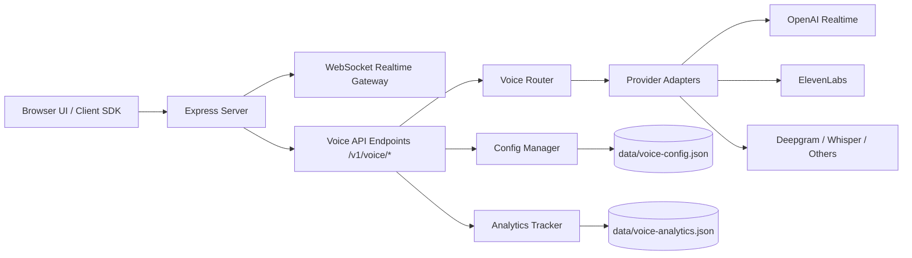
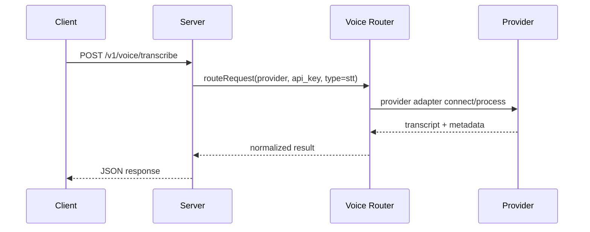

# 🎪 Voice Agent Carnival

Voice Agent Carnival is a multi-provider, real-time voice platform with two main experiences:

- **Voice Echo Agent UI** (`/`) for fast conversational testing over WebSocket, WebRTC, and SIP-style flows.
- **OpenRouter-style Voice API** (`/v1/voice/*`) that routes STT, TTS, realtime, and conversational requests across many providers with BYOK credentials.

---

## Problem

Most teams building voice products run into the same issues:

- Hard to compare providers for latency, quality, and cost
- Separate SDKs and auth flows for each provider
- No single API shape for STT, TTS, and conversational voice
- Poor visibility into usage, health, and cost trends

**Voice Agent Carnival solves this** with one local platform that:

- normalizes provider access,
- supports real-time voice sessions,
- tracks analytics and costs,
- and lets teams prototype quickly from browser UI to API.

---

## Architecture



### Core modules

- `src/core/server.js`: Express app, static UI, health endpoints, WebSocket realtime bridge
- `src/routes/voice-api-endpoints.js`: OpenRouter-like unified HTTP API
- `src/routes/voice-router.js`: Provider routing and adapter dispatch
- `src/config/config-manager.js`: encrypted per-user provider configuration
- `src/services/analytics-tracker.js`: usage and cost tracking
- `public/`: browser UI for live voice testing

---

## Demo visuals

### Product surfaces

- **Echo UI:** `http://localhost:3000`
- **Voice Router UI:** `http://localhost:3000/voice-router`

### Request flow (example)



---

## Setup

### Prerequisites

- Node.js **18+**
- npm
- At least one provider API key (OpenAI recommended to start)

### Install

```bash
git clone https://github.com/hansraj316/voice-agent-carnival.git
cd voice-agent-carnival
npm install
cp .env.example .env
```

### Run

```bash
npm start
```

Development watch mode:

```bash
npm run dev
```

Validation and basic checks:

```bash
npm run validate
npm test
```

---

## Environment variables

Create `.env` from `.env.example`.

| Variable | Required | Default | Purpose |
|---|---|---:|---|
| `OPENAI_API_KEY` | For OpenAI features | - | Realtime sessions, WebSocket proxy, token generation |
| `ELEVENLABS_API_KEY` | Optional | - | ElevenLabs voices + TTS endpoints |
| `PORT` | No | `3000` | HTTP server port |
| `CONFIG_ENCRYPTION_KEY` | Recommended | auto-generated at runtime | Stable encryption key for saved provider configs |
| `DEBUG` | No | `false` | Verbose server logging |
| `NODE_ENV` | No | `development` | Runtime mode |

> Note: If `CONFIG_ENCRYPTION_KEY` is not set, a random key is generated each run, which can prevent previously encrypted config values from being decrypted after restart.

---

## API overview

### Discovery

- `GET /v1/voice/models`
- `GET /v1/voice/providers`
- `GET /v1/voice/providers/:provider`

### Voice operations

- `POST /v1/voice/transcribe`
- `POST /v1/voice/synthesize`
- `POST /v1/voice/chat`
- `POST /v1/voice/realtime/session`

### Config, health, analytics

- `POST /v1/voice/config/provider`
- `GET /v1/voice/health`
- `GET /v1/voice/analytics`
- `GET /v1/voice/cost-report`

---

## Deployment

This project is a long-running Node.js service with WebSocket support.

### Option A: Render / Railway / Fly.io

1. Create a new service from this repo
2. Build command: `npm install`
3. Start command: `npm start`
4. Set environment variables in the platform dashboard
5. Ensure WebSockets are enabled/supported

### Option B: VM / VPS (Ubuntu example)

```bash
npm ci
cp .env.example .env
# fill in env vars
npm install -g pm2
pm2 start src/core/server.js --name voice-agent-carnival
pm2 save
```

Use Nginx/Caddy for TLS termination and reverse proxy to `PORT`.

---

## Local smoke test

```bash
curl http://localhost:3000/health
curl http://localhost:3000/v1/voice/health
curl http://localhost:3000/v1/voice/providers
```

---

## Security notes

- Do not commit `.env`
- Use strong `CONFIG_ENCRYPTION_KEY` in shared or production deployments
- Treat BYOK API keys as sensitive tenant data
- Prefer HTTPS/WSS in production

---

## License

MIT. See `LICENSE`.
